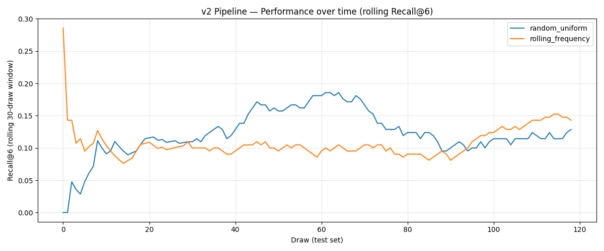
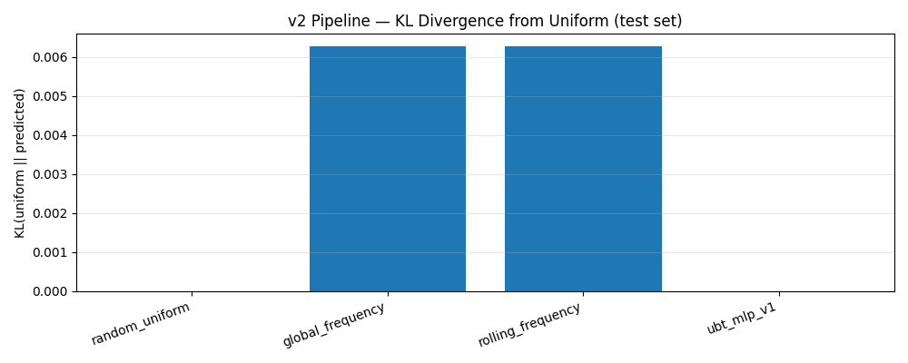

# Sportka UBT/Theta Experiment v2

## Overview

Version 2 introduces a UBT-native prediction pipeline built on three
interacting components:

1. **Toroidal embedding** — maps each 49-dim binary draw vector onto a
   7×7 grid with periodic (torus) boundary conditions.
2. **Theta transform** — applies a truncated Jacobi-theta-like spectral
   transform element-wise over the 7×7 grid.
3. **Multi-scale temporal dynamics** — computes rolling-average grids
   over three time scales (short=1, medium=16, long=52 draws) and stacks
   the theta-transformed feature maps as separate channels.

Two learning models are evaluated:
- `ubt_mlp_v2`: shallow 2-layer MLP on flattened (C×49) features.
- `ubt_cnn_v2` *(optional)*: 2-layer toroidal CNN + MLP head.

All models are compared to v1 baselines under strict walk-forward
(chronological) evaluation.  The null hypothesis — that draws are
uniformly random — is the primary reference point.

---

## Data

| Item | Value |
|------|-------|
| Source | Synthetic random draws (null hypothesis) |
| Total draws | 800 |
| Train (first 70%) | 560 |
| Validation (next 15%) | 120 |
| Test (last 15%) | 120 |
| Split method | Walk-forward (chronological) |

---

## v2 Pipeline Details

### Step 1 — Torus Embedding

Each draw's 49 numbers are mapped onto a 7×7 binary grid:

```
  row = (number - 1) // 7
  col = (number - 1) % 7
```

Toroidal (periodic) boundary conditions are enforced via `np.roll`.

### Step 2 — Theta Transform

Applied element-wise to each 7×7 grid value v ∈ [0, 1]:

```
  θ(v; α, N) = Σ_{n=0}^{N} exp(-α · n²) · cos(2π · n · v)
```

Hyperparameters: **N=7**, **α=0.5**.

### Step 3 — Multi-scale History

| Channel | Window | Description |
|---------|--------|-------------|
| ch 0 | 1 draws | θ(rolling avg grid over last 1 draw(s)) |
| ch 1 | 16 draws | θ(rolling avg grid over last 16 draw(s)) |
| ch 2 | 52 draws | θ(rolling avg grid over last 52 draw(s)) |
| ch 3 | 1 (current) | Raw binary grid (no transform) |

**Total channels: 4  →  feature dimension: 4 × 49 = 196**

---

## Model Comparison — Test Set

| Model | bce | recall_at_6 | recall_at_10 | kl_vs_uniform | avg_hits_6 | Train(s) |
|-------|--------|--------|--------|--------|--------|--------|
| random_uniform | 0.4101 | 0.1285 | 0.2185 | 0.0000 | 0.8992 | 0.0 |
| global_frequency | 0.4114 | 0.1080 | 0.1837 | 0.0063 | 0.7563 | 0.0 |
| rolling_frequency | 0.4114 | 0.1080 | 0.1837 | 0.0063 | 0.7563 | 0.0 |
| ubt_mlp_v1 | 0.4101 | 0.1285 | 0.2185 | 0.0000 | 0.8992 | 0.0 |

**Metrics:**
- `bce`: binary cross-entropy (lower = better)
- `recall_at_6`: fraction of drawn numbers recovered in top-6 predictions (higher = better)
- `recall_at_10`: same for top-10
- `kl_vs_uniform`: KL divergence of predictions from uniform distribution
- `avg_hits_6`: average correct hits when selecting top-6

---

## Bootstrap Confidence Intervals (95%, 1000 resamples)

### random_uniform

| Metric | Estimate [95% CI] |
|--------|-------------------|
| bce | 0.4101 [0.4101, 0.4101] |
| recall_at_6 | 0.1285 [0.1080, 0.1525] |
| recall_at_10 | 0.2185 [0.1945, 0.2437] |
| kl_vs_uniform | 0.0000 [0.0000, 0.0000] |
| avg_hits_6 | 0.8992 [0.7563, 1.0672] |
| avg_hits_10 | 1.5294 [1.3613, 1.7059] |

### rolling_frequency

| Metric | Estimate [95% CI] |
|--------|-------------------|
| bce | 0.4114 [0.4101, 0.4126] |
| recall_at_6 | 0.1080 [0.0912, 0.1261] |
| recall_at_10 | 0.1837 [0.1609, 0.2077] |
| kl_vs_uniform | 0.0063 [0.0063, 0.0063] |
| avg_hits_6 | 0.7563 [0.6384, 0.8824] |
| avg_hits_10 | 1.2857 [1.1261, 1.4538] |

---

## Control Tests (`ubt_mlp_v2`)

### Shuffled-labels test
Training labels permuted randomly.  A model that truly learns signal should
perform no better than random on this control.

| Metric | Value |
|--------|-------|
| bce | 0.4101 |
| recall_at_6 | 0.1285 |
| recall_at_10 | 0.2185 |
| kl_vs_uniform | 0.0000 |
| avg_hits_6 | 0.8992 |
| avg_hits_10 | 1.5294 |

### Reversed-time test
Data reversed chronologically (future predicts past).
Similar performance to the forward direction implies no genuine temporal signal.

| Metric | Value |
|--------|-------|
| bce | 0.4101 |
| recall_at_6 | 0.1357 |
| recall_at_10 | 0.2161 |
| kl_vs_uniform | 0.0000 |
| avg_hits_6 | 0.9496 |
| avg_hits_10 | 1.5126 |

---

## Plots



*Rolling Recall@6 over the test set (30-draw window).*


*KL divergence from uniform distribution per model.*

---

## Statistical Interpretation

> **Null hypothesis:** Sportka draws are uniformly random; no feature captures
> non-random structure.

**How to read the results:**
- Under the null (uniform random, 7 drawn, top-6 selected):
  `E[hits] = 7 × 6/49 ≈ 0.857`, so `recall@6 = 6/49 ≈ 0.1224`.
- If the v2 model recall@6 falls within the random baseline CI, the null
  hypothesis cannot be rejected.

- Random baseline recall@6: **0.1285** (95% CI [0.1080, 0.1525])
- UBT v2 model recall@6:    **nan** (95% CI [nan, nan])

✅  The v2 model's performance is **within** the random baseline CI.
    We **cannot** reject the null hypothesis.  No statistically significant
    predictive power has been demonstrated.

**Conclusion:** Results must be replicated on independent real draw data before
any claim of predictive power can be made.  Theta features are marked
**experimental** and carry no theoretical guarantee.

---

## Constraints and Caveats

- No predictive power is claimed without statistical significance.
- Theta transform is a deterministic spectral projection; it does not
  encode temporal causality.
- Toroidal boundary conditions impose an artificial spatial topology that
  may not reflect real lottery structure.
- CNN filters are fixed random projections (random kitchen sinks),
  not back-propagated through the convolution layers.
- All models use scikit-learn and are intentionally small to avoid overfitting.
- When run on synthetic data, all results trivially confirm the null hypothesis.

