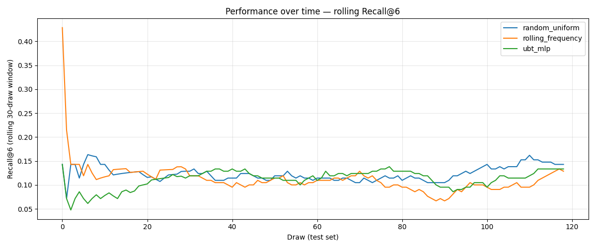
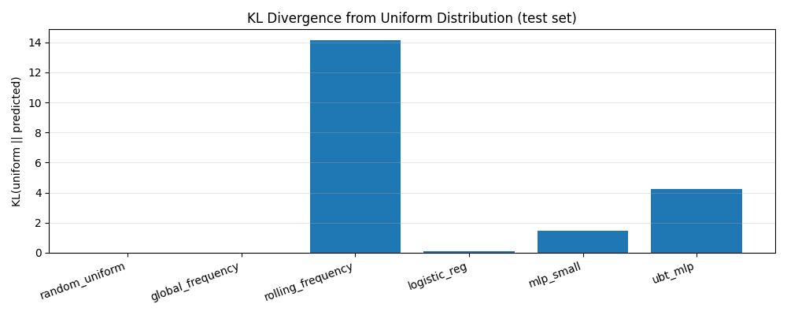

# Sportka UBT/Theta Experiment v1

## Overview

This report presents a rigorous, null-hypothesis-first evaluation of whether
UBT/theta-inspired features capture any non-random structure in Sportka draw
history.  All models are compared against strong random baselines.

**Guiding principles:**
- Sportka draws are treated as a null-hypothesis random system.
- Statistical validation is the primary goal; number prediction is not.
- Overfitting is avoided through strict walk-forward (chronological) splitting.
- All results are compared to a uniform-random baseline.

---

## Data

| Item | Value |
|------|-------|
| Source | Synthetic random draws (null hypothesis) |
| Total draws | 800 |
| Train (first 70%) | 560 |
| Validation (next 15%) | 120 |
| Test (last 15%) | 120 |
| Split method | Walk-forward (chronological) |

---

## Feature Groups

| Group | Dimensions | Description |
|-------|-----------|-------------|
| `base` | 49 | Binary indicator vector for each draw |
| `time` | 13 | Normalised draw index + cyclical sin/cos encodings |
| `winding` | 294 | Rolling & exponential-decay frequency vectors |
| `torus` | 112 | 7×7 grid: row/col sums, toroidal neighbour counts, 3×3 conv |
| `theta` (exp.) | 98 | Truncated Jacobi-theta projection (experimental) |

---

## Model Comparison — Test Set

| Model | Features | n_feat | bce | recall_at_6 | recall_at_10 | kl_vs_uniform | avg_hits_6 |
|-------|----------|--------|--------|--------|--------|--------|--------|
| random_uniform | base_only | 49 | 0.4101 | 0.1224 | 0.2041 | 0.0000 | 0.8571 |
| global_frequency | base_only | 49 | 0.5748 | 0.1080 | 0.1837 | 0.0063 | 0.7563 |
| rolling_frequency | base_winding | 356 | 2.5961 | 0.1092 | 0.2077 | 14.1490 | 0.7647 |
| logistic_reg | base_time | 62 | 0.4265 | 0.1381 | 0.2113 | 0.0971 | 0.9664 |
| mlp_small | base_winding | 356 | 0.6557 | 0.1224 | 0.1969 | 1.4820 | 0.8571 |
| ubt_mlp | ubt_full | 566 | 1.1163 | 0.1164 | 0.1993 | 4.2578 | 0.8151 |

**Metrics:**
- `bce`: binary cross-entropy (lower = better)
- `recall_at_6`: fraction of drawn numbers recovered in top-6 predictions (higher = better)
- `recall_at_10`: same for top-10
- `kl_vs_uniform`: KL divergence of predictions from uniform distribution
- `avg_hits_6`: average number of correct hits when selecting top 6

---

## Bootstrap Confidence Intervals (95%, 1000 resamples)

Test-set metrics for selected models with 95% bootstrap CIs:

### random_uniform

| Metric | Estimate [95% CI] |
|--------|-------------------|
| bce | 0.4101 [0.4101, 0.4101] |
| recall_at_6 | 0.1224 [0.1020, 0.1429] |
| recall_at_10 | 0.2041 [0.1801, 0.2281] |
| kl_vs_uniform | 0.0000 [0.0000, 0.0000] |
| avg_hits_6 | 0.8571 [0.7143, 1.0000] |
| avg_hits_10 | 1.4286 [1.2605, 1.5966] |

### rolling_frequency

| Metric | Estimate [95% CI] |
|--------|-------------------|
| bce | 2.5961 [2.5311, 2.6578] |
| recall_at_6 | 0.1092 [0.0888, 0.1297] |
| recall_at_10 | 0.2077 [0.1836, 0.2329] |
| kl_vs_uniform | 14.1490 [14.1490, 14.1490] |
| avg_hits_6 | 0.7647 [0.6218, 0.9078] |
| avg_hits_10 | 1.4538 [1.2855, 1.6303] |

### ubt_mlp

| Metric | Estimate [95% CI] |
|--------|-------------------|
| bce | 1.1163 [1.0741, 1.1594] |
| recall_at_6 | 0.1164 [0.0948, 0.1369] |
| recall_at_10 | 0.1993 [0.1741, 0.2245] |
| kl_vs_uniform | 4.2578 [4.1450, 4.3738] |
| avg_hits_6 | 0.8151 [0.6639, 0.9582] |
| avg_hits_10 | 1.3950 [1.2185, 1.5714] |

---

## Control Tests (UBT model — `ubt_mlp`)

These tests verify whether the model learns genuine signal or overfits noise.

### Shuffled-labels test
Training labels are permuted randomly, destroying any signal.
If the model truly learns, it should perform no better than random here.

| Metric | Value |
|--------|-------|
| bce | 1.1078 |
| recall_at_6 | 0.1261 |
| recall_at_10 | 0.2029 |
| kl_vs_uniform | 4.2132 |
| avg_hits_6 | 0.8824 |
| avg_hits_10 | 1.4202 |

### Reversed-time test
Data is reversed chronologically (future predicts past).
A causal model should perform worse; similar performance implies no temporal signal.

| Metric | Value |
|--------|-------|
| bce | 1.1486 |
| recall_at_6 | 0.1333 |
| recall_at_10 | 0.2161 |
| kl_vs_uniform | 4.5606 |
| avg_hits_6 | 0.9328 |
| avg_hits_10 | 1.5126 |

---

## Plots

*Rolling Recall@6 over the test set (30-draw window).*

*KL divergence from uniform distribution per model.*

---

## Statistical Interpretation

> **Null hypothesis:** Sportka draws are uniformly random; no feature captures
> non-random structure.

**How to read the results:**
- If `recall_at_6` for UBT/ML models is *within* the bootstrap CI of the random
  baseline, we cannot reject the null hypothesis.
- The expected recall@6 under the null (uniform) is `6/49 ≈ 0.0857` per number
  drawn, or equivalently `7 * (6/49) / 7 = 6/49 ≈ 0.857` of drawn numbers
  recovered if 6 are predicted.  A fairer baseline is `6 * 7 / 49 ≈ 0.857`.

- Random baseline recall@6: **0.1224** (95% CI [0.1020, 0.1429])
- UBT model recall@6:       **0.1164** (95% CI [0.0948, 0.1369])

✅  The UBT model's performance is **within** the random baseline CI.
    We **cannot** reject the null hypothesis.  No statistically significant
    predictive power has been demonstrated.

**Conclusion:** Results must be replicated on independent real draw data before
any claim of predictive power can be made.

---

## Constraints and Caveats

- No predictive power is claimed without statistical significance.
- Theta features are marked **experimental** and lack theoretical justification
  beyond exploratory interest.
- Torus embedding is a deterministic projection that may encode number
  proximity artefacts without capturing true lottery structure.
- All models use scikit-learn and are intentionally small to avoid overfitting.
- If run on synthetic data, all results trivially confirm the null hypothesis.

