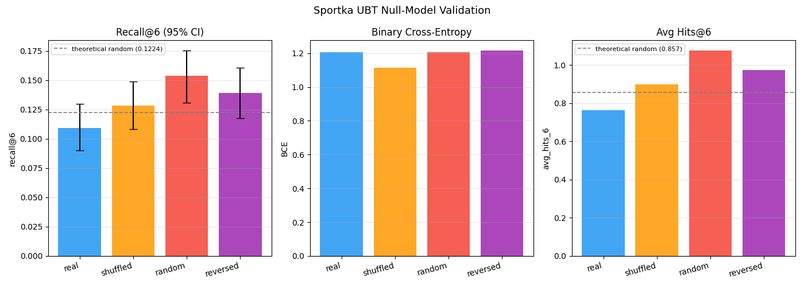

# Sportka UBT Null-Model Validation

## Overview

This experiment tests whether UBT/theta features capture real structure
or merely overfit noise.  The same UBT pipeline is run unmodified on four
data variants:

| Condition | Description |
|-----------|-------------|
| **real**     | Original draw order (temporal structure intact) |
| **shuffled** | Draw rows randomly permuted (temporal order destroyed) |
| **random**   | Freshly generated synthetic draws (pure noise baseline) |
| **reversed** | Chronological order reversed (future predicts past) |

**Constraints:** No changes to feature engineering or model hyperparameters.
This is an evaluation-only experiment.

---

## Data

| Item | Value |
|------|-------|
| Source | Synthetic random draws (null hypothesis) |
| Total draws | 800 |
| Train (70%) | 559 |
| Test (15%) | 119 |
| Split | Walk-forward (chronological) |
| Bootstrap resamples | 1000 |

---

## Metrics per Condition — Test Set

| Condition | bce | recall_at_6 | recall_at_10 | kl_vs_uniform | avg_hits_6 | avg_hits_10 |
|-----------|--------|--------|--------|--------|--------|--------|
| **real** | 1.2062 | 0.1092 | 0.1993 | 4.5244 | 0.7647 | 1.3950 |
| **shuffled** | 1.1156 | 0.1285 | 0.2149 | 4.0685 | 0.8992 | 1.5042 |
| **random** | 1.2060 | 0.1537 | 0.2293 | 4.8789 | 1.0756 | 1.6050 |
| **reversed** | 1.2152 | 0.1393 | 0.2161 | 4.6169 | 0.9748 | 1.5126 |

**Theoretical random baseline** (7 drawn, top-6 selected):
  `recall@6 ≈ 0.1224`, `avg_hits_6 ≈ 0.8571`

---

## Bootstrap Confidence Intervals (95%, 1 000 resamples)

### real

| Metric | Estimate [95% CI] |
|--------|-------------------|
| bce | 1.2062 [1.1558, 1.2561] |
| recall_at_6 | 0.1092 [0.0900, 0.1297] |
| recall_at_10 | 0.1993 [0.1717, 0.2257] |
| kl_vs_uniform | 4.5244 [4.3977, 4.6598] |
| avg_hits_6 | 0.7647 [0.6303, 0.9076] |
| avg_hits_10 | 1.3950 [1.2017, 1.5800] |

### shuffled

| Metric | Estimate [95% CI] |
|--------|-------------------|
| bce | 1.1156 [1.0646, 1.1682] |
| recall_at_6 | 0.1285 [0.1080, 0.1489] |
| recall_at_10 | 0.2149 [0.1885, 0.2413] |
| kl_vs_uniform | 4.0685 [3.9566, 4.1738] |
| avg_hits_6 | 0.8992 [0.7561, 1.0420] |
| avg_hits_10 | 1.5042 [1.3193, 1.6891] |

### random

| Metric | Estimate [95% CI] |
|--------|-------------------|
| bce | 1.2060 [1.1563, 1.2565] |
| recall_at_6 | 0.1537 [0.1309, 0.1753] |
| recall_at_10 | 0.2293 [0.2053, 0.2533] |
| kl_vs_uniform | 4.8789 [4.7184, 5.0544] |
| avg_hits_6 | 1.0756 [0.9160, 1.2269] |
| avg_hits_10 | 1.6050 [1.4368, 1.7731] |

### reversed

| Metric | Estimate [95% CI] |
|--------|-------------------|
| bce | 1.2152 [1.1643, 1.2712] |
| recall_at_6 | 0.1393 [0.1176, 0.1609] |
| recall_at_10 | 0.2161 [0.1944, 0.2401] |
| kl_vs_uniform | 4.6169 [4.4941, 4.7356] |
| avg_hits_6 | 0.9748 [0.8235, 1.1261] |
| avg_hits_10 | 1.5126 [1.3611, 1.6807] |

---

## Delta: Other Conditions vs Real

Positive values indicate the null condition scored *higher* than real data.
For recall@6 and avg_hits, a positive delta means the null condition appears
*better* (or equally good) as the real condition — evidence against signal.

| Delta | bce | recall_at_6 | recall_at_10 | kl_vs_uniform | avg_hits_6 | avg_hits_10 |
|-------|--------|--------|--------|--------|--------|--------|
| Δ real→shuffled | -0.0906 | +0.0192 | +0.0156 | -0.4560 | +0.1345 | +0.1092 |
| Δ real→random | -0.0001 | +0.0444 | +0.0300 | +0.3545 | +0.3109 | +0.2101 |
| Δ real→reversed | +0.0090 | +0.0300 | +0.0168 | +0.0925 | +0.2101 | +0.1176 |

---

## Plots

*Recall@6, BCE, and Avg Hits@6 across all four conditions.*
*Error bars on Recall@6 are 95% bootstrap CIs.*

---

## Decision

**Verdict: NO_SIGNAL**

UBT model performance on real data is statistically indistinguishable from at least two of the three null conditions (shuffled, random, reversed). This indicates **no detectable structure** in the Sportka data.

### Decision rule applied

| Condition pair | recall@6 real | recall@6 other | CIs overlap? |
|----------------|--------------|----------------|--------------|
| real vs shuffled | 0.1092 [0.0900, 0.1297] | 0.1285 [0.1080, 0.1489] | Yes ✅ |
| real vs random | 0.1092 [0.0900, 0.1297] | 0.1537 [0.1309, 0.1753] | No ⚠️ |
| real vs reversed | 0.1092 [0.0900, 0.1297] | 0.1393 [0.1176, 0.1609] | Yes ✅ |

*'Yes' means the 95% CIs of recall@6 for real and null condition overlap.*
*Overlap in ≥ 2 conditions → NO_SIGNAL verdict.*

---

## Interpretation

> **Null hypothesis:** Sportka draws are uniformly random; UBT/theta features
> capture no non-random structure.

Under the null:
- Expected `recall@6 ≈ 0.1224` (theoretical)
- Expected `avg_hits_6 ≈ 0.8571` (theoretical)
- All four conditions should produce statistically identical results.

If performance on **real** data is statistically indistinguishable from
**shuffled**, **random**, and **reversed** data, the null hypothesis cannot
be rejected and UBT features are concluded to capture **no real structure**.

---

*Report generated automatically by `sportka/experiments/run_null_test.py`.*